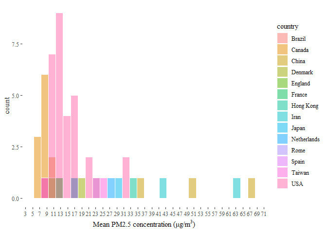
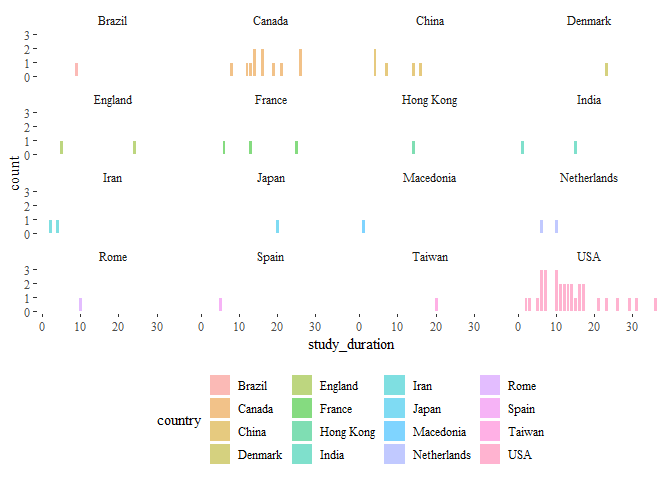

<!-- README.md is generated from README.Rmd. Please edit that file -->

# Epidemiological Studies: Meta Analysis

<!-- badges: start -->
<!-- badges: end -->

The goal of epi.meta.analysis is to:

-   Exhaustively Explore epidemiological research studies to figure out
    the regional (country wise) PM2.5 exposure range covered in these
    studies.
-   Identify and plot the locations of these studies on a map to
    identify locations where no/very few cohort studies have been
    undertaken.
-   Better understand the relationship between PM2.5 and Mortality/Life
    Expectancy.

# Analysis and Plots

-   Note: All data that is used to generate the graphs below can be
    found in the `data-raw` sub-directory, which is present at the root
    of the `epi.meta.analysis` directory.

## PM2.5 distributions of the lower limits and upper limits of exposure range (Density and Histogram Plots)

-   From **Plot 1**, it looks like most of the studies are present in
    concentration ranges that are less than 50 µg/m³. According to AQLIs
    latest estimates, 12.6 percent (\~962 million people) of the world
    population live in areas where PM2.5 pollution concentration is
    greater than 50 µg/m³.

## Country Wise Mean PM2.5 distribution (Density Plot and Historgram)

## Choropleth world map: mapping the total number of epidemiological studies (specifically those that are trying to better understand the relationship between PM2.5 and Mortality/Life Expectancy).

## Age distributions of lower limits and upper limits of age range (Density and Histogram plots)

## Country wise distribution of Cohort Sizes (Density and Histogram plots)

## Country wise Distribution of Study Duration (Density and Histogram Plots)

## AQLI data, top 10 most polluted countries: PM2.5 distributions Histograms and Summary Table

### Summary Table

| Country                          | Average PM2.5 2020 (µg/m³) |
|:---------------------------------|---------------------------:|
| Bangladesh                       |                   75.75863 |
| India                            |                   55.79855 |
| Nepal                            |                   47.12727 |
| Pakistan                         |                   44.17125 |
| Democratic Republic of the Congo |                   34.19913 |
| Rwanda                           |                   32.95480 |
| Myanmar                          |                   32.43946 |
| Burundi                          |                   31.76077 |
| China                            |                   31.63255 |
| Republic of Congo                |                   31.62412 |
