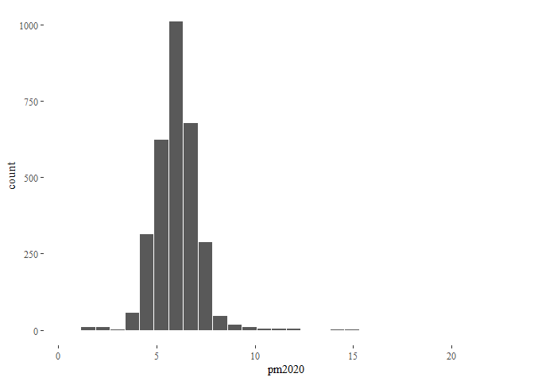

<!-- README.md is generated from README.Rmd. Please edit that file -->

# Epidemiological Studies: Meta Analysis

<!-- badges: start -->
<!-- badges: end -->

The goal of epi.meta.analysis is to:

-   Explore the current epidemiological research studies and figure out
    the PM2.5 exposure range covered.
-   Identify and plot the locations of these studies on a map to
    identify locations where no/very few cohort studies have been
    performed.
-   Better understand the relationship between PM2.5 and Mortality.

# Studying the distribution of mean PM2.5

\*\* Note: All data that is used to generate the graphs below can be
found in the `data-raw` sub-directory, which is present at the root of
the `epi.meta.analysis` directory.

## Plot 1: PM2.5 distributions of the lower limits and upper limits of exposure range

-   From **Plot 1**, it looks like most of the studies are present in
    concentration ranges that are less than 50 µg/m³. According to AQLIs
    latest estimates, 12.6 percent (\~962 million people) of the world
    population live in areas where PM2.5 pollution concentration is
    greater than 50 µg/m³.

## Plot 2: mean PM2.5 distribution (country wise)

    #> Warning: Groups with fewer than two data points have been dropped.
    #> Groups with fewer than two data points have been dropped.
    #> Groups with fewer than two data points have been dropped.
    #> Groups with fewer than two data points have been dropped.
    #> Groups with fewer than two data points have been dropped.
    #> Groups with fewer than two data points have been dropped.
    #> Groups with fewer than two data points have been dropped.
    #> Warning in max(ids, na.rm = TRUE): no non-missing arguments to max; returning
    #> -Inf

    #> Warning in max(ids, na.rm = TRUE): no non-missing arguments to max; returning
    #> -Inf

    #> Warning in max(ids, na.rm = TRUE): no non-missing arguments to max; returning
    #> -Inf

    #> Warning in max(ids, na.rm = TRUE): no non-missing arguments to max; returning
    #> -Inf

    #> Warning in max(ids, na.rm = TRUE): no non-missing arguments to max; returning
    #> -Inf

    #> Warning in max(ids, na.rm = TRUE): no non-missing arguments to max; returning
    #> -Inf

    #> Warning in max(ids, na.rm = TRUE): no non-missing arguments to max; returning
    #> -Inf

## Plot 3: Choropleth map mapping the count of total number of pm2.5-mortality studies conducted arounf the world.

## Plot 4: Age distributions of lower limits and upper limits of age range

# Plot 5: Distribution of Cohort Size

    #> Warning: Removed 16 rows containing non-finite values (stat_density).

# Plot 6: Distribution of Study Duration

    #> Warning: Ignoring unknown parameters: binwidth, bins, pad
    #> Warning: Removed 13 rows containing non-finite values (stat_count).

# Plot7: AQLI data, pm2.5 distributions (country wise)

    #> `stat_bin()` using `bins = 30`. Pick better value with `binwidth`.

