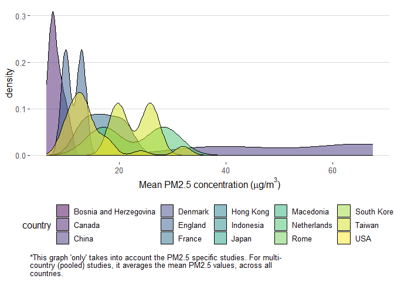
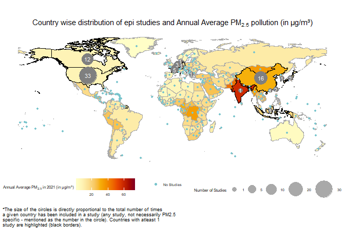
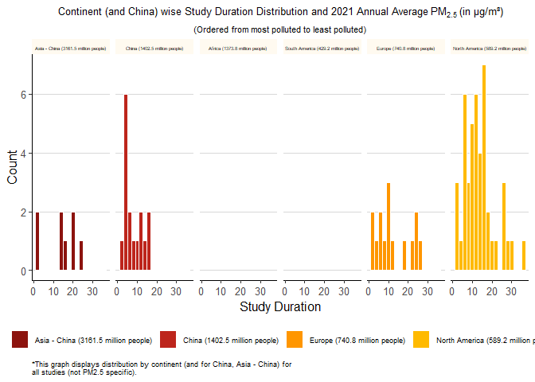
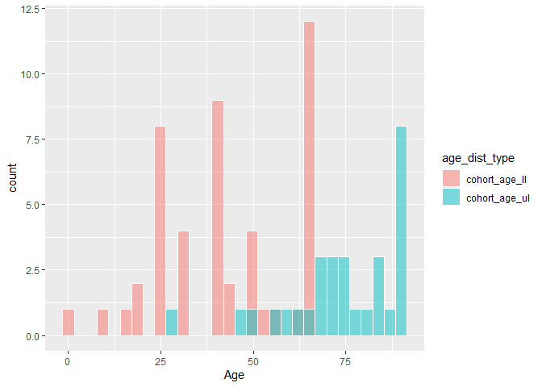
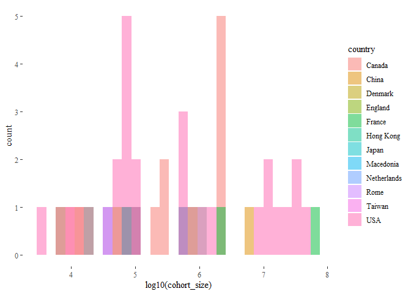

<!-- README.md is generated from README.Rmd. Please edit that file -->

# Epidemiological Studies: Meta Analysis

<!-- badges: start -->
<!-- badges: end -->

This analysis is our best first attempts to capture all large cohort
(\>3239 people; max cohort size: 73 million), long term ((\> 2 years,
max study duration: 36 years) epidemiological studies that measure the
impact of ambient PM2.5, PM10, TSP, Ultra Fine
Particulate Matter on Mortality/Life Expectancy published between 1993
and present\*, findable in available peer-reviewed literature.
Hereafter, referred to as **AQ epi studies** for short.

We are seeking to make this analysis as current, complete and error-free
as possible and view it as a continual work in progress. We would
appreciate the air quality community’s comments, corrections, and
suggestions. Please contact **<aqli-epic@uchicago.eduI>** or leave a
comment in this GitHub repository.

## Purpose

The purpose of this analysis is to understand the landscape of
epidemiological research on the relationship between PM2.5,
PM10, TSP, Ultrafine Particulate Matter and Mortality/Life
Expectancy and to surface demographic, geographic, or other trends that
may exist in the current state of literature. While the overall arc of
the relationship between these pollutants and human health is clear to
take action, such trends can help the field reflect on itself, take
stock of any biases or gaps – and point toward future research and
policy opportunities.

## Why do epidemiological studies on air pollution and mortality matter?

While global estimates of air pollution’s toll on public health vary,
they all point in the same direction: air pollution poses one of the
largest health risks on the planet to humans
\[[Paper1](https://www.pnas.org/doi/10.1073/pnas.1300018110),
[Paper2](https://www.pnas.org/doi/full/10.1073/pnas.1616784114),
[Paper3](https://pubs.acs.org/doi/pdf/10.1021/acs.estlett.8b00360),
[Paper4](https://pubs.acs.org/doi/pdf/10.1021/acs.estlett.8b00360)\].
Epidemiological studies on air pollution and mortality help us
understand the burden of air pollution on human health at global,
national and regional levels. According to [Vahlsing and Smith
(2012)](https://pubs.acs.org/doi/pdf/10.1021/acs.estlett.8b00360), these
sorts of studies can also help countries take policy action, pushing
forward and shaping national-level ambient air quality standards.

The burden of air pollution across the world is also not uniform. While
97.3 percent of the world population is out of compliance with the
latest WHO annual PM2.5 guideline of 5 µg/m³, there is huge
variation in the quality of air one breathes.

## Please Note

-   The underlying [****analysis
    dataset****](https://docs.google.com/spreadsheets/d/1AljEJhNPLWX_8xRbT_HJuERBpbQt_QGixgJ9jEzFyQw/edit#gid=2082201996)
    for this meta analysis focuses only on those papers that study the
    link between **PM2.5**, **PM10**, **TSP**,
    **Fine Particulate Matter** and ****Mortality/Life Expectancy****.
    In addition to the analysis dataset, there is a [****master
    dataset****](https://docs.google.com/spreadsheets/d/1AljEJhNPLWX_8xRbT_HJuERBpbQt_QGixgJ9jEzFyQw/edit#gid=0)
    that expands on the analysis dataset to include other useful
    information. The idea behind the master dataset is to record any
    additional details (whether additional facts about the paper, or
    details on other pollutants studied in the paper) that will not be a
    part of the main data analysis exercise.

-   This analysis dataset excludes pooled studies, unpublished papers
    and other meta-analysis to avoid double counting as it is primarily
    used to generate summary stats and graphs. But, the master dataset
    includes all of these studies.

-   In many papers, only one of the mean PM2.5 or
    PM2.5 range is reported but not both. In these cases,
    wherever the data is not available (whether it is mean PM2.5 or
    PM2.5 range) we have recorded a NA.

-   In a small set of papers, we couldn’t find the minimum
    PM2.5 concentration. In these cases, we have assumed the
    lowest available percentile data available on PM2.5 concentration as
    the minimum concentration.

-   For papers in which pollutants other than PM2.5 and
    PM10 have been studied over different periods of time, we
    have chosen the specific time period that corresponds to the
    PM2.5 and PM10 pollutants.

-   We have recorded one mean PM2.5 value for each paper.
    But, there are papers where more than one mean PM2.5
    value is reported (for example, one for the male group and one for
    the female group). In these cases, we have picked one value from the
    ones that are available (and mostly they are not significantly
    different from each other).

-   In some papers, the exact start and/or end year of a study is
    unclear. In these cases, we have mostly chosen the first instance of
    the multiple “study duration ranges” (depending on when the final
    follow up ended) the paper.

-   Under the “methods” column, we have only mentioned a subset of
    methods that were used to carry out different parts of the study.
    Authors may have used other methods than those mentioned in our meta
    analysis.

-   Different graphs are generated using different subsets of the master
    [analysis
    dataset](https://docs.google.com/spreadsheets/d/1AljEJhNPLWX_8xRbT_HJuERBpbQt_QGixgJ9jEzFyQw/edit#gid=2082201996).
    Some are PM2.5 specific, others include all pollutants
    (PM2.5, PM10, TSP, Ultrafine Particles). The
    type of papers used to generate a given graph is specified within
    the graph and/or the accompanying text.

## Results

 

### PM2.5 exposure range and the Global Population Distribution

 

 

-   In total 74 AQI epi studies were included in the final [analysis
    dataset](https://docs.google.com/spreadsheets/d/1AljEJhNPLWX_8xRbT_HJuERBpbQt_QGixgJ9jEzFyQw/edit#gid=2082201996).

-   12.7 percent of the world population, or 962.9 million people, live
    in areas where the annual average PM2.5 pollution is
    greater than 50 µg/m³. But, only 5 percent (3 studies) of the total
    studies, have been performed in these highly polluted parts of the
    world. These highly polluted areas are areas where the average
    PM2.5 pollution is at least 10 times the WHO
    PM2.5 safe guideline of 5 µg/m³.

-   Approximately 5.5 percent of the world population (420.4 million
    people) live in the most severely polluted parts of the world, where
    annual average PM2.5 pollution is upwards of 75 µg/m³ (at
    least 15 times the WHO safe guideline). In these most severely
    polluted parts of the world, 0 AQ epi studies have been performed .

-   Most of the AQ epi studies (81.7 percent of the total, or 49
    studies) performed so far, are concentrated in areas where the
    average PM2.5 concentration is in the 0-25 µg/m³ range.
    People living in these areas (59.2 percent of the world population)
    are breathing air that is much less polluted relative to the people
    living in the most polluted parts of the world (as seen above). But,
    even in the 0-25 µg/m³ bucket, anyone living above 5 µg/m³, is out
    of compliance with the WHO guideline.

 

### Geographic Distribution of Studies

-   44 of the 74 (59.5 percent) studies were performed in the USA and
    Canada.

-   56 of the 74 studies (75.7 percent) were performed in the USA,
    Canada and Europe combined. Remaining 24.3 percent (18 studies) are
    scattered across China, Japan, Iran, Taiwan, Hong Kong, Brazil and
    India.

 

### AQ Epi studies over time

 

-   In most of the 90’s and early 2000’s, the rate of AQ epi studies
    publishing was around 1 to 2 studies per annum.

-   Post 2009, there has been a noticeable increase in the overall
    volume of AQ epi studies published.

### Distribution of duration of study by continent

 

-   All of the “really” long term studies (\> 25 years) ever conducted
    are concentrated only in Canada, USA, France.

-   For almost all study durations in the distributions below, roughly 3
    times more studies have been performed in North America, when
    compared with other places like Asia and Europe and South America.

-   It is important to note that in South America only 1 study has been
    performed and no study has been performed in the continent of
    Africa.

### Major takeaways

-   59.5 percent of the total number of studies are concentrated in the
    USA and Canada alone.

-   In comparison, approximately 5.5 percent of the world population, or
    420.4 million people live in areas where PM2.5 pollution
    concentrations are upwards of 75 µg/m³ (at least 15 times the WHO
    safe guideline). In these parts of the world, no AQ epi studies have
    been performed.

-   All of the “really” long term studies (\> 25 years) ever conducted
    are concentrated only in Canada, USA, France.

-   No study has been conducted in the African continent and only 1 has
    been conducted in the continent of South America.

-   In the last decade, there has been a noticeable increase in the
    total number of AQ epi studies performed. But, most of these new
    studies are concentrated in the low pollution concentration ranges
    of 0-25 µg/m³. The high pollution concentration ranges remain poorly
    explored, with the really high ones (\> 75\` µg/m³) not explored at
    all.

### Conclusion

All studies included in this analysis point to the same overall
picture:air pollution is a serious health threat. The existing state of
scientific literature on air pollution and health is clear that air
pollution’s impact on health is well-established and taking action in a
polluted environment should not be delayed in order to complete
multi-year large cohort epidemiological studies in an area, even if
there has not been a prior study in that particular geography. That
said, it is important for the field of air quality epidemiolgy to
understand the contours of its current research landscape to most
effectively identify directions for future research and deploy limited
resources.

 

### Methodology

Through a comprehensive and ongoing\* literature review, we are making
an attempt at creating an exhaustive public listing of all the
epidemiological studies out there (that we could find) that examine the
relationship between PM2.5 and Life Expectancy/Mortality.

For each study, we record data on key defining features, such as:
Geography, Cohort Size, Study Duration, PM2.5 exposure range,
etc. Then we used
[this](https://docs.google.com/spreadsheets/d/1AljEJhNPLWX_8xRbT_HJuERBpbQt_QGixgJ9jEzFyQw/edit#gid=2082201996)
analysis dataset to carry out a meta-analysis, results of which are
detailed in the Results section above.

We are seeking to make this analysis as current, complete and error-free
as possible and view it as a continual work in progress. We would
welcome the air quality community’s any comments, corrections, andor
suggestions. Please contact **<aqli-epic@uchicago.edu>** or leave a
comment in this GitHub repository.

 

### How can you (the community) help in improving this analysis?

-   Add to the [master
    dataset](https://docs.google.com/spreadsheets/d/1AljEJhNPLWX_8xRbT_HJuERBpbQt_QGixgJ9jEzFyQw/edit#gid=2082201996)
    and and grow the epi database:

    -   If you know of other papers that: (a) are attempting to study
        the link between PM2.5 and Life Expectancy/Mortality
        and (b) are not included in this analysis: Please leave a
        comment in the [master dataset
        sheet](https://docs.google.com/spreadsheets/d/1AljEJhNPLWX_8xRbT_HJuERBpbQt_QGixgJ9jEzFyQw/edit#gid=0),
        providing a link to the paper. You can also write to us at
        <aqli-info@uchicago.edu> (with the link to the paper mentioned
        in the email).

    -   As a next step, we’ll go through your submission, update the
        underlying analysis dataset and re-render the entire blog, so
        that it represents the most up to date data and figures.

    -   In case you have comments on some aspects of a paper/if you find
        any errors, please leave a comment in the [master dataset
        sheet](https://docs.google.com/spreadsheets/d/1AljEJhNPLWX_8xRbT_HJuERBpbQt_QGixgJ9jEzFyQw/edit#gid=0)
        or write to us at <aqli-info@uchicago.edu>.

 

 

### References

 

 

### Other Graphs

#### PM2.5 distributions of the lower limits and upper limits of exposure range (Density and Histogram Plots)

#### Age distributions of lower limits and upper limits of age range (Density and Histogram plots)

#### Country wise distribution of Cohort Sizes (Density and Histogram plots)

#### Country wise Distribution of Study Duration (Density and Histogram Plots)

#### AQLI data, top 10 most polluted countries: PM2.5 distributions Histograms and Summary Table

#### Summary Table

| Country                          | Average PM2.5 2020 (µg/m³) |
|:---------------------------------|---------------------------:|
| Bangladesh                       |                   75.75863 |
| India                            |                   55.79855 |
| Nepal                            |                   47.12727 |
| Pakistan                         |                   44.17125 |
| Democratic Republic of the Congo |                   34.19913 |
| Rwanda                           |                   32.95480 |
| Myanmar                          |                   32.43946 |
| Burundi                          |                   31.76077 |
| China                            |                   31.63255 |
| Republic of Congo                |                   31.62412 |
