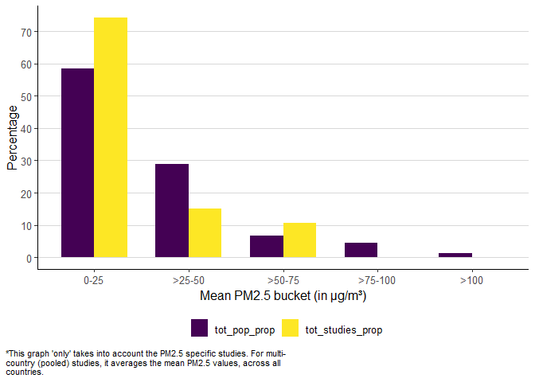
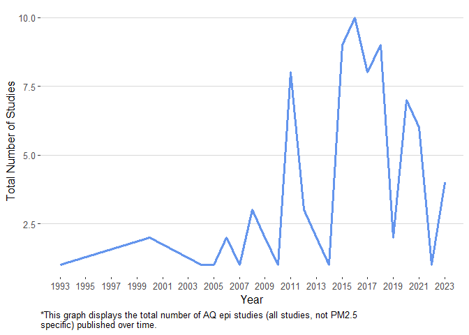

<!-- README.md is generated from README.Rmd. Please edit that file -->

# Epidemiological Studies: Meta Analysis

<!-- badges: start -->
<!-- badges: end -->

This analysis is our best first attempt to capture all epidemiological
research studies (\>1000 people; max sample size: 73 million), that are
relatively long term ((\> 1 years, max study duration: 36 years) and
measure the impact of **ambient** PM2.5, PM10,
TSP, Ultra Fine Particulate Matter on Mortality (cause-specific, all
cause, pre-mature)/Life Expectancy published between 1993 and present\*,
findable in available peer-reviewed literature. Hereafter, referred to
as **AQ epi studies** for short.

We are seeking to make this analysis as current, complete and error-free
as possible and view it as a continual work in progress. We would
appreciate the air quality community’s comments, corrections, and
suggestions. Please contact **<aqli-epic@uchicago.edu>** or leave a
comment in [this](https://github.com/aqli-epic/epi.meta.analysis) GitHub
repository/directly leave comments in the [****analysis
dataset****](https://docs.google.com/spreadsheets/d/1AljEJhNPLWX_8xRbT_HJuERBpbQt_QGixgJ9jEzFyQw/edit#gid=2082201996)
(more on this below).

## Purpose

The purpose of this analysis is to understand the landscape of
epidemiological research on the relationship between PM2.5,
PM10, TSP, Ultrafine Particulate Matter and Mortality (all
types, as specified above)/Life Expectancy and to surface demographic,
geographic, or other trends that may exist in the current state of
literature. While the overall arc of the relationship between these
pollutants and human health is clear to take action, such trends can
help the field reflect on itself, take stock of any biases or gaps – and
point toward future research and policy opportunities.

## Why do epidemiological studies on air pollution and mortality matter?

While global estimates of air pollution’s toll on public health vary,
they all point in the same direction: air pollution poses one of the
largest health risks on the planet to humans
\[[Paper1](https://www.pnas.org/doi/10.1073/pnas.1300018110),
[Paper2](https://www.pnas.org/doi/full/10.1073/pnas.1616784114),
[Paper3](https://pubs.acs.org/doi/pdf/10.1021/acs.estlett.8b00360),
[Paper4](https://pubs.acs.org/doi/pdf/10.1021/acs.estlett.8b00360)\].
Epidemiological studies on air pollution and mortality help us
understand the burden of air pollution on human health at global,
national and regional levels. According to [Vahlsing and Smith
(2012)](https://link.springer.com/content/pdf/10.1007/s11869-010-0131-2.pdf),
these sorts of studies can also help countries take policy action,
pushing forward and shaping national-level ambient air quality
standards.

The burden of air pollution across the world is also not uniform. While
97.3 percent of the world population is out of compliance with the
latest WHO annual PM2.5 guideline of 5 µg/m³, there is huge
variation in the quality of air one breathes.

## Inclusion/Exclusion Criteria for studies

-   The underlying [****analysis
    dataset****](https://docs.google.com/spreadsheets/d/1AljEJhNPLWX_8xRbT_HJuERBpbQt_QGixgJ9jEzFyQw/edit#gid=2082201996)
    for this meta analysis focuses only on those papers that study the
    link between **PM2.5**, **PM10**, **TSP**,
    **Fine Particulate Matter** and ****Mortality/Life Expectancy****.
    In addition to the analysis dataset, there is a [****master
    dataset****](https://docs.google.com/spreadsheets/d/1AljEJhNPLWX_8xRbT_HJuERBpbQt_QGixgJ9jEzFyQw/edit#gid=0)
    that expands on the analysis dataset to include other useful
    information. The idea behind the master dataset is to record any
    additional details (whether additional facts about the paper, or
    details on other pollutants studied in the paper) that will not be a
    part of the main data analysis exercise. Master dataset will also
    list additional papers that do not fit into the inclusion criteria.

-   The analysis dataset excludes the following types of papers:
    meta-analysis, unpublished papers, papers studying the effects of
    indoor air pollution on Mortality/Life Expectancy, papers
    forecasting future air pollution/life expectancy/mortality. But, the
    master dataset lists all of these studies.

-   In Multi-Country (pooled) studies, one entry (one row in the
    analysis dataset) is recorded for each country in papers where
    country level data is available. There are some pooled studies where
    country level data is not available, but rather data is available
    for a custom region (e.g. South-East Asia), such pooled studies are
    excluded from the analysis dataset. But, the master dataset still
    lists all of these additional studies for reference.

-   In cases where the same cohort is studied by different research
    groups at different point in time/using different methods: we have
    included and counted all of those studies as separate unique studies
    in the analysis below.

-   Papers studying the health effects of pollution segregated by
    sectors (source apportionment type studies), regions (example, Rural
    v/s Urban), season (Winter v/s Summer) are excluded from this
    analysis.

-   All papers studying the measure the impact of pollutants on DALY’s,
    are excluded from this analysis.

## Other important points

-   In papers, where the minimum PM2.5 concentration was not
    reported, we have assumed the lowest available percentile data
    available on PM2.5 concentration as the minimum concentration.

-   In many papers, only one of the mean PM2.5 or
    PM2.5 range is reported but not both. In these cases,
    wherever the data is not available (whether it is mean PM2.5 or
    PM2.5 range) we have recorded a NA. Apart from this, anywhere we
    couldn’t find data, we have recorded a NA.

-   In multi-pollutant studies where different pollutants have been
    studied over different periods of time, we have chosen the specific
    time period that corresponds to the PM2.5 pollutant (in
    cases where we PM2.5 is not present, we have recorded the
    time period corresponding to one of the other pollutants).

-   We have recorded one mean PM2.5 value for each paper.
    But, there are papers where more than one mean PM2.5
    value is reported (for example, one for the male group and one for
    the female group). In these cases, we have picked one value from the
    ones that are available.

-   In some papers, the exact start and/or end year of a study is
    unclear. In these cases, we have mostly chosen the first instance of
    the multiple “study duration ranges” (depending on multiple
    plausible interpretations of when the final follow up ended) the
    paper.

-   In many papers, the upper limit or lower limit for age is not
    precisely specified. In these cases, we have recorded a NA. For
    example, there are papers where the upper limit category for age is
    85+. In these cases, although we know the upper limit category, we
    still don’t know the upper limit of the age, which could be 90, 95,
    100, etc.

-   In places, where the sample size is specifed in terms of “number of
    regions” (for example, 17 districts) and not “number of people”, we
    have recorded a NA in the cohort size column.

-   Under the “methods” column (in the master dataset), we have only
    mentioned a subset of methods that were used to carry out different
    parts of the study. Authors may have used other methods than those
    mentioned in our meta analysis.

-   Different graphs are generated using different subsets of the
    [analysis
    dataset](https://docs.google.com/spreadsheets/d/1AljEJhNPLWX_8xRbT_HJuERBpbQt_QGixgJ9jEzFyQw/edit#gid=2082201996).
    Most of them are PM2.5 specific (our main focus), others
    include all pollutants (PM2.5, PM10, TSP,
    Ultrafine Particles). The type of papers used to generate a given
    graph and other nuances for the graph in question are specified
    within the graph (as a note) and/or the accompanying text.

## Results

 

### PM2.5 exposure range and the Global Population Distribution

 

 

-   In total 68 AQ epi studies were included in the final [analysis
    dataset](https://docs.google.com/spreadsheets/d/1AljEJhNPLWX_8xRbT_HJuERBpbQt_QGixgJ9jEzFyQw/edit#gid=2082201996).
    Of these, 58 were PM2.5 specific. Others (10 studies) are
    multi-pollutant studies.

-   12.7 percent of the world population, or 962.9 million people, live
    in areas where the annual average PM2.5 pollution is
    greater than 50 µg/m³. But, only 6.9 percent (4 PM2.5
    specific studies) of the total PM2.5 studies, have been
    performed in these highly polluted parts of the world. These highly
    polluted areas are areas where the average PM2.5
    pollution is at least 10 times the WHO PM2.5 safe
    guideline of 5 µg/m³.

-   Approximately 5.5 percent of the world population (420.4 million
    people) live in the most severely polluted parts of the world, where
    annual average PM2.5 pollution is upwards of 75 µg/m³ (at
    least 15 times the WHO safe guideline). In these most severely
    polluted parts of the world, 0 PM2.5 AQ epi studies have
    been performed .

-   Most of the PM2.5 AQ epi studies (75.9 percent of the
    total number of PM2.5 studies, or 44 studies) performed
    so far, are concentrated in areas where the average PM2.5
    concentration is in the 0-25 µg/m³ range. People living in these
    areas (59.2 percent of the world population) are breathing air that
    is much less polluted relative to the people living in the most
    polluted parts of the world (as seen above). But, even in the 0-25
    µg/m³ bucket, anyone living above 5 µg/m³, is out of compliance with
    the WHO PM2.5 guideline.

 

### Geographic Distribution of Studies

-   60.3 percent of all AQ epi studies (41 studies) included in this
    analysis included populations in either the US or Canada or both.

-   USA, Canada and Europe (or some combination of them) were focus
    countries in 77.9 percent of all AQ epi studies (53 studies). Other
    countrie(s) that have been included in an AQ epi study: China,
    Japan, Hong Kong, Taiwan.

-   Of the total number of times a given continent’s population has been
    included in any given AQ epi study, North America dominates the rest
    of the continents and has been included 60.3 percent of times (all
    due to studies in the US or Canada). Closely following North
    America, populations in Asia and Europe have been included in AQ epi
    studies 22.1 and 17.6 percent of times respectively. Africa, South
    America, Oceania have seen 0 long term (\> 1 year), large (\>1000
    people in the sample) AQ epi study.

 

### AQ Epi studies over time

 

-   In most of the 90’s and early 2000’s, the rate of AQ epi studies
    publishing was around 1 to 2 studies per annum on average.

-   Post 2009, there has been a noticeable increase in the overall
    volume of AQ epi studies published.

### Distribution of duration of study by continent

 

-   In total, 7 “really” long term studies (\> 25 years) have been
    performed. That is, 10.3 percent of the total number of studies.

-   All of the following continents have seen at least 1 really long
    term study: North America, Europe.

-   All of the following continents have seen more than 1 really long
    term study: North America.

-   In all of the really long term studies (including both
    multi-country/continent and single-country), i.e. ones that have a
    study duration of \> 25 years - North America was included 6 times
    in those studies (85.7 percent of the total number of times any
    given continent is included in any given study).

-   Similarly, Europe has been included 1 times in such long term
    studies (14.3 percent of the total number of times any given
    continent is included in any given study).

### Major takeaways

-   60.3 percent of all AQ epi studies (41 studies) included in this
    analysis included populations in either the US or Canada or both.

-   Of the total number of times a given continent’s population has been
    included in any given AQ epi study, North America dominates the rest
    of the continents and has been included 60.3 percent of times (all
    due to studies in the US or Canada). Closely following North
    America, populations in Asia and Europe have been included in AQ epi
    studies 22.1 and 17.6 percent of times respectively. Africa, South
    America, Oceania have seen 0 long term (\> 1 year), large (\>1000
    people in the sample) AQ epi study.

-   There have been no large (\> 1 year) or long (\>1000 people in the
    sample) PM epi studies that were performed in Africa, South America,
    Oceania, with a combined population of 1.8 billion, 23.3 percent of
    the Earth’s total human population.

-   Post 2009, there has been a noticeable increase in the overall
    volume of AQ epi studies published.

-   In total, 7 “really” long term studies (\> 25 years) have been
    performed. That is, 10.3 percent of the total number of studies.

-   All of the following continents have seen at least 1 really long
    term study: North America, Europe.

### Conclusion

All studies included in this analysis point to the same overall
picture:air pollution is a serious health threat. The existing state of
scientific literature on air pollution and health is clear that air
pollution’s impact on health is well-established and taking action in a
polluted environment should not be delayed in order to complete
multi-year large sample (\> 1000) epidemiological studies in an area,
even if there has not been a prior study in that particular geography.
That said, it is important for the field of air quality epidemiolgy to
understand the contours of its current research landscape to most
effectively identify directions for future research and deploy limited
resources.

 

### Methodology

Through a comprehensive and ongoing\* literature review, we are making
an attempt at creating an exhaustive public listing of all the
epidemiological studies out there (that we could find) that examine the
relationship between PM2.5 and Life Expectancy/Mortality.

For each study, we record data on key defining features, such as:
Geography, Sample Size, Study Duration, PM2.5 exposure range,
etc. Then we used
[this](https://docs.google.com/spreadsheets/d/1AljEJhNPLWX_8xRbT_HJuERBpbQt_QGixgJ9jEzFyQw/edit#gid=2082201996)
analysis dataset to carry out a meta-analysis, results of which are
detailed in the Results section above.

We are seeking to make this analysis as current, complete and error-free
as possible and view it as a continual work in progress. We would
welcome the air quality community’s any comments, corrections, andor
suggestions. Please contact **<aqli-epic@uchicago.edu>** or leave a
comment in this GitHub repository.

### Limitations (To be discussed)

 

### How can you (the community) help in improving this analysis?

-   Add to the [****analysis
    dataset****](https://docs.google.com/spreadsheets/d/1AljEJhNPLWX_8xRbT_HJuERBpbQt_QGixgJ9jEzFyQw/edit#gid=2082201996)
    and and grow the epi database:

-   If you know of other papers that: (a) are attempting to study the
    link between PM2.5 and Life Expectancy/Mortality and (b)
    are not included in this analysis: Please leave a comment in the
    [****analysis
    dataset****](https://docs.google.com/spreadsheets/d/1AljEJhNPLWX_8xRbT_HJuERBpbQt_QGixgJ9jEzFyQw/edit#gid=2082201996),
    providing a link to the paper. You can also write to us at
    <aqli-info@uchicago.edu> (with the link to the paper mentioned in
    the email).

    -   As a next step, we’ll go through your submission, and if it fits
        our inclusion criteria, we will update the underlying analysis
        dataset and re-render the entire blog, so that it represents the
        most up to date data and figures.

    -   If you are unsure (given the inclusion criteria) about whether a
        particular paper (that you want to post) should be posted on
        not, we encourage you to post it and let us worry about the
        inclusion/exclusion bit.

-   In case you have comments on some aspects of a paper/if you find any
    errors, please leave a comment in the [****analysis
    dataset****](https://docs.google.com/spreadsheets/d/1AljEJhNPLWX_8xRbT_HJuERBpbQt_QGixgJ9jEzFyQw/edit#gid=2082201996)
    on the cell (tagging <aqli-info@uchicago.edu>, using \*\*@\*\*
    symbol) where the error is found or write to us at
    <aqli-info@uchicago.edu>, detailing the error and its location (cell
    address on the sheet).

 

 

### References

 

 

### Other Graphs and Interactive Summary Dashboard

To further explore these graphs and more in an interactive setup, visit
the [AQ Epi
dashboard](https://aarsh.shinyapps.io/aqli-epic-epi-meta-analysis/).
